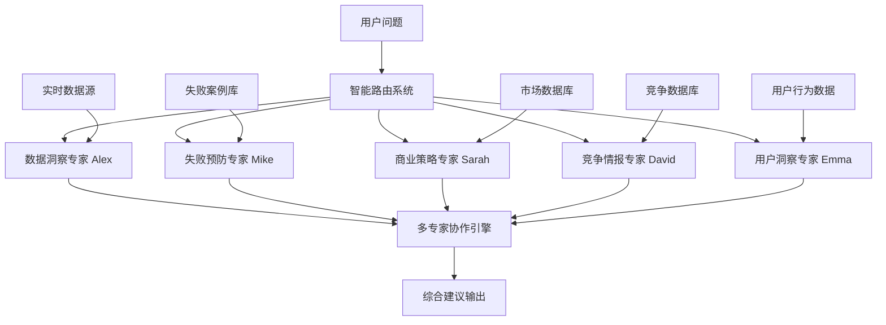

# 创业者AI专家产品完整解决方案

## 🎯 产品愿景

**打造全球首个基于实时数据分析的创业失败预防AI专家平台**

为小企业主和多次创业者提供数据驱动的智能决策支持，通过多专家协作模式，帮助创业者在关键决策点避免失败陷阱，提高创业成功率。

**核心价值主张**: 让数据说话，让专家指路，让失败可预防

---

## 📊 产品定位与差异化优势

### 市场定位

**目标用户**: 
- 小企业主 (年营收10万-1000万)
- 多次创业者 (有1-3次创业经历)
- 初次创业者 (需要专业指导)
- 企业内部创新团队

**市场痛点**:
1. **缺乏数据支撑的决策**: 90%的创业决策基于直觉而非数据
2. **无法预见失败风险**: 42%的创业失败因为"没有市场需求"
3. **缺乏专业指导**: 传统咨询费用高昂，难以负担
4. **信息孤岛**: 各种数据分散，无法形成整体洞察

### 差异化优势

| 维度 | 传统AI助手 | 我们的产品 |
|------|------------|------------|
| **数据基础** | 通用知识库 | 实时市场数据 + 失败案例库 |
| **专家模式** | 单一通用助手 | 5个专业AI专家协作 |
| **预防能力** | 被动回答 | 主动风险预警 |
| **个性化** | 标准化回复 | 基于项目数据定制 |
| **实用性** | 理论建议 | 可执行的行动计划 |
| **学习能力** | 静态知识 | 从失败案例持续学习 |

---

## 🤖 AI专家团队架构

### 专家团队组成



### 1. 数据洞察专家 Alex 📊

**专业领域**: 数据分析、趋势预测、市场洞察

**核心能力**:
- 实时市场数据分析
- 用户行为数据解读
- 趋势预测和机会识别
- 数据可视化和报告生成

**人格特征**:
- 理性、客观、数据驱动
- 善于发现数据背后的故事
- 总是用数据支撑观点

**典型对话场景**:
```
用户: "我想做一个在线教育平台，市场前景如何？"

📊 数据洞察专家Alex:
"让我为你分析最新的市场数据：

📈 市场规模分析:
• 在线教育市场规模: 2024年达到$350B，年增长率8.7%
• 细分领域机会: 职业技能培训增长最快(15.2%)
• 用户付费意愿: 平均每年$1,200，比去年增长23%

🎯 用户行为洞察:
• 学习时长: 平均每周3.5小时，移动端占67%
• 完课率: 行业平均32%，优质平台可达65%
• 付费转化: 免费试用转付费平均8.5%

⚠️ 关键发现:
• 市场集中度高: 前5名占据52%市场份额
• 获客成本上升: 同比增长34%，平均$89/用户
• 用户留存挑战: 6个月留存率仅23%

💡 数据建议:
1. 专注细分领域，避开红海竞争
2. 重点优化用户留存，这比获客更重要
3. 移动优先策略，67%用户偏好移动学习

需要我深入分析哪个细分领域的数据？"
```

### 2. 失败预防专家 Mike ⚠️

**专业领域**: 风险识别、失败预防、危机管理

**核心能力**:
- 创业失败案例分析
- 风险评估和预警
- 预防策略制定
- 危机应对方案

**人格特征**:
- 经验丰富、直言不讳
- 总是从最坏情况考虑
- 关注细节和潜在风险

**典型对话场景**:
```
用户: "我的产品已经开发了6个月，但用户增长很慢，怎么办？"

⚠️ 失败预防专家Mike:
"6个月用户增长缓慢是个危险信号，让我帮你做风险诊断：

🚨 危险信号检测:
• 产品市场匹配度可能存在问题
• 68%的类似项目在这个阶段失败
• 主要失败原因: 产品不符合市场需求(42%)

📊 请提供关键数据:
• 当前用户数量和月增长率
• 用户留存率(7天、30天)
• 用户反馈和满意度
• 剩余资金和烧钱率

🔍 基于经验判断:
如果月增长率<20%且30天留存率<30%，你需要立即采取行动：

立即行动(1周内):
1. 深度访谈20个流失用户，找出真实原因
2. 分析用户行为数据，识别流失节点
3. 重新审视产品核心价值主张

快速调整(1个月内):
4. 基于用户反馈优化核心功能
5. 重新设计用户引导流程
6. 考虑产品定位调整

🚦 止损线:
如果2个月后指标仍无改善，建议考虑:
• 产品转型
• 及时止损，保留剩余资金

记住：及时调整不是失败，固执己见才是。

你愿意分享具体数据让我做更精准的风险评估吗？"
```

### 3. 商业策略专家 Sarah 💼

**专业领域**: 商业模式、战略规划、增长策略

**核心能力**:
- 商业模式设计和优化
- 增长策略制定
- 竞争策略分析
- 商业计划制定

**人格特征**:
- 战略思维、全局观强
- 善于平衡短期和长期目标
- 注重可执行性

### 4. 竞争情报专家 David 🎯

**专业领域**: 竞争分析、市场情报、差异化策略

**核心能力**:
- 竞争对手分析
- 市场定位策略
- 差异化优势识别
- 竞争策略制定

### 5. 用户洞察专家 Emma 👥

**专业领域**: 用户研究、需求分析、体验优化

**核心能力**:
- 用户需求分析
- 用户体验优化
- 用户画像构建
- 产品功能优先级

---

## 🔧 技术架构设计

### 系统整体架构

```python
# 系统核心架构
class AIExpertPlatform:
    def __init__(self):
        # 核心组件
        self.expert_router = ExpertRouter()
        self.data_engine = DataEngine()
        self.collaboration_engine = CollaborationEngine()
        self.knowledge_base = KnowledgeBase()
        self.user_context = UserContextManager()
        
        # AI专家实例
        self.experts = {
            'data_insight': DataInsightExpert(),
            'failure_prevention': FailurePreventionExpert(),
            'business_strategy': BusinessStrategyExpert(),
            'competition_intelligence': CompetitionIntelligenceExpert(),
            'user_insight': UserInsightExpert()
        }
    
    def process_user_query(self, user_id: str, query: str, context: dict) -> dict:
        """处理用户查询的主流程"""
        
        # 1. 分析查询意图
        intent = self.analyze_query_intent(query, context)
        
        # 2. 路由到合适的专家
        primary_expert = self.expert_router.route_to_expert(intent)
        
        # 3. 获取相关数据
        relevant_data = self.data_engine.get_relevant_data(user_id, intent)
        
        # 4. 专家分析
        expert_analysis = self.experts[primary_expert].analyze(
            query, relevant_data, context
        )
        
        # 5. 多专家协作(如需要)
        if expert_analysis.get('needs_collaboration'):
            collaborative_insights = self.collaboration_engine.collaborate(
                primary_expert, expert_analysis, relevant_data
            )
            expert_analysis.update(collaborative_insights)
        
        # 6. 生成回复
        response = self.generate_response(expert_analysis, context)
        
        # 7. 更新用户上下文
        self.user_context.update_context(user_id, query, response)
        
        return response
```

### 数据引擎设计

```python
class DataEngine:
    def __init__(self):
        self.data_sources = {
            'market_data': MarketDataSource(),
            'user_behavior': UserBehaviorDataSource(),
            'competition_data': CompetitionDataSource(),
            'failure_cases': FailureCaseDataSource(),
            'industry_trends': IndustryTrendDataSource()
        }
        self.data_processor = DataProcessor()
        self.cache_manager = CacheManager()
    
    def get_relevant_data(self, user_id: str, intent: dict) -> dict:
        """获取与用户查询相关的数据"""
        
        relevant_data = {}
        
        # 基于意图确定需要的数据源
        required_sources = self.determine_data_sources(intent)
        
        for source_name in required_sources:
            # 检查缓存
            cache_key = f"{user_id}_{source_name}_{intent['category']}"
            cached_data = self.cache_manager.get(cache_key)
            
            if cached_data and not self.is_data_stale(cached_data):
                relevant_data[source_name] = cached_data
            else:
                # 获取新数据
                fresh_data = self.data_sources[source_name].fetch_data(
                    user_id, intent
                )
                processed_data = self.data_processor.process(fresh_data, intent)
                
                # 更新缓存
                self.cache_manager.set(cache_key, processed_data)
                relevant_data[source_name] = processed_data
        
        return relevant_data
    
    def determine_data_sources(self, intent: dict) -> list:
        """基于意图确定需要的数据源"""
        source_mapping = {
            'market_analysis': ['market_data', 'industry_trends', 'competition_data'],
            'risk_assessment': ['failure_cases', 'market_data', 'user_behavior'],
            'strategy_planning': ['market_data', 'competition_data', 'industry_trends'],
            'user_research': ['user_behavior', 'market_data'],
            'competition_analysis': ['competition_data', 'market_data']
        }
        
        return source_mapping.get(intent['category'], ['market_data'])
```

### 多专家协作引擎

```python
class CollaborationEngine:
    def __init__(self):
        self.collaboration_patterns = CollaborationPatterns()
        self.consensus_builder = ConsensusBuilder()
        self.conflict_resolver = ConflictResolver()
    
    def collaborate(self, primary_expert: str, primary_analysis: dict, data: dict) -> dict:
        """多专家协作分析"""
        
        # 确定需要协作的专家
        collaborating_experts = self.determine_collaborating_experts(
            primary_expert, primary_analysis
        )
        
        # 收集各专家的观点
        expert_opinions = {}
        for expert_name in collaborating_experts:
            expert = self.get_expert(expert_name)
            opinion = expert.provide_opinion(primary_analysis, data)
            expert_opinions[expert_name] = opinion
        
        # 构建共识
        consensus = self.consensus_builder.build_consensus(
            primary_analysis, expert_opinions
        )
        
        # 解决冲突
        if consensus.get('has_conflicts'):
            resolved_consensus = self.conflict_resolver.resolve_conflicts(
                consensus, expert_opinions
            )
            consensus = resolved_consensus
        
        # 生成协作洞察
        collaborative_insights = {
            'multi_expert_consensus': consensus,
            'expert_opinions': expert_opinions,
            'confidence_score': self.calculate_confidence_score(consensus),
            'action_recommendations': self.generate_action_recommendations(consensus)
        }
        
        return collaborative_insights
    
    def determine_collaborating_experts(self, primary_expert: str, analysis: dict) -> list:
        """确定需要协作的专家"""
        collaboration_rules = {
            'data_insight': {
                'high_risk_detected': ['failure_prevention'],
                'market_opportunity': ['business_strategy', 'competition_intelligence'],
                'user_behavior_anomaly': ['user_insight']
            },
            'failure_prevention': {
                'market_risk': ['data_insight', 'competition_intelligence'],
                'product_risk': ['user_insight'],
                'strategy_risk': ['business_strategy']
            },
            'business_strategy': {
                'need_market_data': ['data_insight'],
                'competitive_pressure': ['competition_intelligence'],
                'user_feedback_needed': ['user_insight']
            }
        }
        
        collaborators = []
        primary_rules = collaboration_rules.get(primary_expert, {})
        
        for condition, experts in primary_rules.items():
            if self.check_condition(condition, analysis):
                collaborators.extend(experts)
        
        return list(set(collaborators))  # 去重
```

---

## 💻 前端界面设计

### 主界面布局

```jsx
// MainDashboard.jsx
import React, { useState, useEffect } from 'react';
import ExpertChat from './components/ExpertChat';
import RiskDashboard from './components/RiskDashboard';
import DataInsights from './components/DataInsights';
import ProjectOverview from './components/ProjectOverview';

const MainDashboard = () => {
  const [activeExpert, setActiveExpert] = useState(null);
  const [projectData, setProjectData] = useState(null);
  const [riskAlerts, setRiskAlerts] = useState([]);

  const experts = [
    {
      id: 'data_insight',
      name: 'Alex',
      title: '数据洞察专家',
      avatar: '📊',
      specialty: '市场数据分析',
      status: 'online'
    },
    {
      id: 'failure_prevention',
      name: 'Mike',
      title: '失败预防专家',
      avatar: '⚠️',
      specialty: '风险识别预防',
      status: 'online'
    },
    {
      id: 'business_strategy',
      name: 'Sarah',
      title: '商业策略专家',
      avatar: '💼',
      specialty: '战略规划',
      status: 'online'
    },
    {
      id: 'competition_intelligence',
      name: 'David',
      title: '竞争情报专家',
      avatar: '🎯',
      specialty: '竞争分析',
      status: 'online'
    },
    {
      id: 'user_insight',
      name: 'Emma',
      title: '用户洞察专家',
      avatar: '👥',
      specialty: '用户研究',
      status: 'online'
    }
  ];

  return (
    <div className="main-dashboard">
      {/* 顶部导航 */}
      <header className="dashboard-header">
        <div className="header-left">
          <h1>🚀 创业AI专家平台</h1>
          <div className="project-selector">
            <select value={projectData?.id || ''} onChange={handleProjectChange}>
              <option value="">选择项目</option>
              {/* 项目列表 */}
            </select>
          </div>
        </div>
        
        <div className="header-right">
          <div className="risk-indicator">
            <span className={`risk-badge ${getRiskLevel(projectData?.risk_score)}`}>
              风险等级: {getRiskLevel(projectData?.risk_score)}
            </span>
          </div>
          <div className="user-menu">
            
          </div>
        </div>
      </header>

      <div className="dashboard-content">
        {/* 左侧专家选择 */}
        <aside className="experts-sidebar">
          <div className="sidebar-header">
            <h3>🤖 AI专家团队</h3>
            <p>选择专家开始对话</p>
          </div>
          
          <div className="experts-list">
            {experts.map(expert => (
              <div 
                key={expert.id}
                className={`expert-card ${activeExpert?.id === expert.id ? 'active' : ''}`}
                onClick={() => setActiveExpert(expert)}
              >
                <div className="expert-avatar">{expert.avatar}</div>
                <div className="expert-info">
                  <div className="expert-name">{expert.name}</div>
                  <div className="expert-title">{expert.title}</div>
                  <div className="expert-specialty">{expert.specialty}</div>
                </div>
                <div className={`expert-status ${expert.status}`}>
                  <span className="status-dot"></span>
                  {expert.status === 'online' ? '在线' : '离线'}
                </div>
              </div>
            ))}
          </div>

          {/* 快速操作 */}
          <div className="quick-actions">
            <h4>🚀 快速操作</h4>
            <button className="action-btn" onClick={() => startRiskAssessment()}>
              📊 风险评估
            </button>
            <button className="action-btn" onClick={() => startMarketAnalysis()}>
              📈 市场分析
            </button>
            <button className="action-btn" onClick={() => startCompetitorAnalysis()}>
              🎯 竞争分析
            </button>
          </div>
        </aside>

        {/* 主内容区域 */}
        <main className="main-content">
          {activeExpert ? (
            <ExpertChat 
              expert={activeExpert}
              projectData={projectData}
              onExpertSwitch={setActiveExpert}
            />
          ) : (
            <div className="dashboard-overview">
              {/* 项目概览 */}
              <ProjectOverview projectData={projectData} />
              
              {/* 风险仪表板 */}
              <RiskDashboard 
                projectData={projectData}
                alerts={riskAlerts}
                onAlertClick={handleAlertClick}
              />
              
              {/* 数据洞察 */}
              <DataInsights projectData={projectData} />
            </div>
          )}
        </main>

        {/* 右侧信息面板 */}
        <aside className="info-panel">
          {/* 实时风险警报 */}
          <div className="risk-alerts">
            <h4>⚠️ 风险警报</h4>
            {riskAlerts.map(alert => (
              <div key={alert.id} className={`alert-item ${alert.level}`}>
                <div className="alert-icon">{alert.icon}</div>
                <div className="alert-content">
                  <div className="alert-title">{alert.title}</div>
                  <div className="alert-time">{alert.time}</div>
                </div>
              </div>
            ))}
          </div>

          {/* 今日建议 */}
          <div className="daily-recommendations">
            <h4>💡 今日建议</h4>
            <div className="recommendations-list">
              {/* 建议列表 */}
            </div>
          </div>

          {/* 学习资源 */}
          <div className="learning-resources">
            <h4>📚 学习资源</h4>
            <div className="resources-list">
              <div className="resource-item">
                <span className="resource-icon">📖</span>
                <span className="resource-title">创业失败案例分析</span>
              </div>
              <div className="resource-item">
                <span className="resource-icon">🎥</span>
                <span className="resource-title">市场分析方法论</span>
              </div>
            </div>
          </div>
        </aside>
      </div>
    </div>
  );
};

export default MainDashboard;
```

### 专家对话界面

```jsx
// ExpertChat.jsx
import React, { useState, useEffect, useRef } from 'react';

const ExpertChat = ({ expert, projectData, onExpertSwitch }) => {
  const [messages, setMessages] = useState([]);
  const [inputValue, setInputValue] = useState('');
  const [isTyping, setIsTyping] = useState(false);
  const [collaboratingExperts, setCollaboratingExperts] = useState([]);
  const messagesEndRef = useRef(null);

  useEffect(() => {
    // 专家切换时的欢迎消息
    const welcomeMessage = generateWelcomeMessage(expert, projectData);
    setMessages([welcomeMessage]);
  }, [expert, projectData]);

  const generateWelcomeMessage = (expert, projectData) => {
    const welcomeMessages = {
      'data_insight': `👋 你好！我是数据洞察专家Alex。我可以帮你分析市场数据、用户行为和行业趋势。${projectData ? `我已经看到了你的项目"${projectData.name}"的数据，` : ''}有什么想了解的吗？`,
      'failure_prevention': `⚠️ 你好！我是失败预防专家Mike。我见过太多创业失败的案例，我的使命是帮你避开那些致命的陷阱。${projectData ? `让我先看看你的项目风险状况...` : ''}`,
      'business_strategy': `💼 你好！我是商业策略专家Sarah。我专注于帮你制定可执行的商业策略和增长计划。${projectData ? `基于你的项目情况，我有一些初步想法...` : ''}`,
      'competition_intelligence': `🎯 你好！我是竞争情报专家David。我会帮你深入了解竞争对手，找到你的差异化优势。${projectData ? `我已经分析了你所在行业的竞争格局...` : ''}`,
      'user_insight': `👥 你好！我是用户洞察专家Emma。我专注于理解用户需求和优化用户体验。${projectData ? `我注意到你的用户数据有一些有趣的模式...` : ''}`
    };

    return {
      id: Date.now(),
      type: 'expert',
      expert: expert,
      content: welcomeMessages[expert.id] || '你好！我是AI专家，有什么可以帮助你的？',
      timestamp: new Date(),
      isWelcome: true
    };
  };

  const handleSendMessage = async () => {
    if (!inputValue.trim()) return;

    const userMessage = {
      id: Date.now(),
      type: 'user',
      content: inputValue,
      timestamp: new Date()
    };

    setMessages(prev => [...prev, userMessage]);
    setInputValue('');
    setIsTyping(true);

    try {
      // 发送消息到后端
      const response = await fetch('/api/expert-chat', {
        method: 'POST',
        headers: { 'Content-Type': 'application/json' },
        body: JSON.stringify({
          expert_id: expert.id,
          message: inputValue,
          project_data: projectData,
          conversation_history: messages
        })
      });

      const data = await response.json();

      // 专家回复
      const expertMessage = {
        id: Date.now() + 1,
        type: 'expert',
        expert: expert,
        content: data.response,
        timestamp: new Date(),
        data_sources: data.data_sources,
        confidence_score: data.confidence_score,
        collaboration: data.collaboration
      };

      setMessages(prev => [...prev, expertMessage]);

      // 如果有协作专家
      if (data.collaboration && data.collaboration.collaborating_experts) {
        setCollaboratingExperts(data.collaboration.collaborating_experts);
        
        // 显示协作专家的观点
        data.collaboration.expert_opinions.forEach((opinion, index) => {
          setTimeout(() => {
            const collaborationMessage = {
              id: Date.now() + index + 2,
              type: 'collaboration',
              expert: opinion.expert,
              content: opinion.content,
              timestamp: new Date(),
              isCollaboration: true
            };
            setMessages(prev => [...prev, collaborationMessage]);
          }, (index + 1) * 1000);
        });
      }

    } catch (error) {
      console.error('发送消息失败:', error);
      const errorMessage = {
        id: Date.now() + 1,
        type: 'error',
        content: '抱歉，发生了错误，请稍后重试。',
        timestamp: new Date()
      };
      setMessages(prev => [...prev, errorMessage]);
    } finally {
      setIsTyping(false);
    }
  };

  const scrollToBottom = () => {
    messagesEndRef.current?.scrollIntoView({ behavior: "smooth" });
  };

  useEffect(() => {
    scrollToBottom();
  }, [messages]);

  return (
    <div className="expert-chat">
      {/* 聊天头部 */}
      <div className="chat-header">
        <div className="expert-info">
          <div className="expert-avatar-large">{expert.avatar}</div>
          <div className="expert-details">
            <h3>{expert.name} - {expert.title}</h3>
            <p>{expert.specialty}</p>
            <div className="expert-status online">
              <span className="status-dot"></span>
              在线
            </div>
          </div>
        </div>

        {/* 协作专家指示器 */}
        {collaboratingExperts.length > 0 && (
          <div className="collaboration-indicator">
            <span className="collaboration-text">协作中:</span>
            <div className="collaborating-experts">
              {collaboratingExperts.map(collab_expert => (
                <div key={collab_expert.id} className="collab-expert-avatar" title={collab_expert.name}>
                  {collab_expert.avatar}
                </div>
              ))}
            </div>
          </div>
        )}

        {/* 快速操作 */}
        <div className="chat-actions">
          <button className="action-btn" onClick={() => exportConversation()}>
            📄 导出对话
          </button>
          <button className="action-btn" onClick={() => clearConversation()}>
            🗑️ 清空对话
          </button>
        </div>
      </div>

      {/* 消息列表 */}
      <div className="messages-container">
        {messages.map(message => (
          <div key={message.id} className={`message ${message.type}`}>
            {message.type === 'expert' || message.type === 'collaboration' ? (
              <div className="expert-message">
                <div className="message-avatar">{message.expert.avatar}</div>
                <div className="message-content">
                  <div className="message-header">
                    <span className="expert-name">{message.expert.name}</span>
                    {message.isCollaboration && (
                      <span className="collaboration-badge">协作观点</span>
                    )}
                    <span className="message-time">
                      {message.timestamp.toLocaleTimeString()}
                    </span>
                  </div>
                  <div className="message-text">
                    <ReactMarkdown>{message.content}</ReactMarkdown>
                  </div>
                  
                  {/* 数据来源 */}
                  {message.data_sources && (
                    <div className="data-sources">
                      <span className="sources-label">数据来源:</span>
                      {message.data_sources.map(source => (
                        <span key={source} className="source-tag">{source}</span>
                      ))}
                    </div>
                  )}
                  
                  {/* 置信度 */}
                  {message.confidence_score && (
                    <div className="confidence-score">
                      <span className="confidence-label">置信度:</span>
                      <div className="confidence-bar">
                        <div 
                          className="confidence-fill"
                          style={{ width: `${message.confidence_score * 100}%` }}
                        />
                      </div>
                      <span className="confidence-value">
                        {Math.round(message.confidence_score * 100)}%
                      </span>
                    </div>
                  )}
                </div>
              </div>
            ) : (
              <div className="user-message">
                <div className="message-content">
                  <div className="message-text">{message.content}</div>
                  <div className="message-time">
                    {message.timestamp.toLocaleTimeString()}
                  </div>
                </div>
                <div className="message-avatar">👤</div>
              </div>
            )}
          </div>
        ))}
        
        {/* 正在输入指示器 */}
        {isTyping && (
          <div className="typing-indicator">
            <div className="expert-message">
              <div className="message-avatar">{expert.avatar}</div>
              <div className="typing-animation">
                <span></span>
                <span></span>
                <span></span>
              </div>
            </div>
          </div>
        )}
        
        <div ref={messagesEndRef} />
      </div>

      {/* 输入区域 */}
      <div className="chat-input">
        <div className="input-container">
          <textarea
            value={inputValue}
            onChange={(e) => setInputValue(e.target.value)}
            placeholder={`向${expert.name}提问...`}
            onKeyPress={(e) => {
              if (e.key === 'Enter' && !e.shiftKey) {
                e.preventDefault();
                handleSendMessage();
              }
            }}
            rows={1}
          />
          <button 
            className="send-btn"
            onClick={handleSendMessage}
            disabled={!inputValue.trim() || isTyping}
          >
            📤
          </button>
        </div>
        
        {/* 快速问题建议 */}
        <div className="quick-questions">
          {getQuickQuestions(expert.id).map(question => (
            <button 
              key={question}
              className="quick-question-btn"
              onClick={() => setInputValue(question)}
            >
              {question}
            </button>
          ))}
        </div>
      </div>
    </div>
  );
};

const getQuickQuestions = (expertId) => {
  const questions = {
    'data_insight': [
      '我的行业市场趋势如何？',
      '用户行为数据有什么异常？',
      '竞争对手的数据表现怎样？'
    ],
    'failure_prevention': [
      '我的项目有哪些风险？',
      '如何避免常见的失败陷阱？',
      '现在应该采取什么预防措施？'
    ],
    'business_strategy': [
      '我应该如何制定增长策略？',
      '商业模式需要调整吗？',
      '下一步的战略重点是什么？'
    ],
    'competition_intelligence': [
      '主要竞争对手是谁？',
      '我的差异化优势在哪里？',
      '竞争格局有什么变化？'
    ],
    'user_insight': [
      '用户真正需要什么？',
      '如何提高用户满意度？',
      '用户流失的主要原因是什么？'
    ]
  };
  
  return questions[expertId] || [];
};

export default ExpertChat;
```

---

## 🚀 实施路线图

### 第一阶段：MVP开发 (3个月)

**目标**: 验证核心概念，获得初始用户反馈

**核心功能**:
1. **基础专家系统** (1个月)
   - 实现数据洞察专家Alex
   - 基础对话功能
   - 简单的数据分析能力

2. **风险评估功能** (1个月)
   - 失败预防专家Mike
   - 基础风险评估模型
   - 简单的预警系统

3. **用户界面** (1个月)
   - 基础聊天界面
   - 简单的数据可视化
   - 用户项目管理

**成功指标**:
- 100个种子用户
- 用户日活跃度 >30%
- 用户满意度 >4.0/5.0
- 核心功能使用率 >60%

### 第二阶段：功能完善 (3个月)

**目标**: 完善专家团队，增强协作能力

**新增功能**:
1. **完整专家团队** (1.5个月)
   - 商业策略专家Sarah
   - 竞争情报专家David
   - 用户洞察专家Emma

2. **多专家协作** (1个月)
   - 专家协作引擎
   - 共识构建机制
   - 冲突解决系统

3. **高级分析功能** (0.5个月)
   - 深度数据分析
   - 预测模型
   - 个性化建议

**成功指标**:
- 1000个活跃用户
- 用户留存率 >50%
- 专家协作使用率 >40%
- 用户推荐率 >60%

### 第三阶段：规模化发展 (6个月)

**目标**: 扩大用户规模，优化商业模式

**重点工作**:
1. **产品优化** (2个月)
   - 基于用户反馈优化
   - 性能优化
   - 移动端适配

2. **商业化** (2个月)
   - 付费功能设计
   - 企业版本开发
   - 合作伙伴集成

3. **市场推广** (2个月)
   - 内容营销
   - 合作伙伴渠道
   - 用户增长策略

**成功指标**:
- 10000个注册用户
- 月收入 >$50K
- 企业客户 >50家
- 市场认知度显著提升

---

## 💰 商业模式设计

### 收入模式

#### 1. 订阅模式 (主要收入来源)

**个人版** - $29/月
- 基础专家咨询 (每月50次对话)
- 基础风险评估
- 标准数据分析
- 社区支持

**专业版** - $99/月
- 无限专家咨询
- 高级风险评估和预警
- 深度数据分析和预测
- 多专家协作
- 个性化建议
- 优先客服支持

**企业版** - $299/月
- 团队协作功能
- 企业级数据安全
- 定制化专家配置
- API接入
- 专属客户成功经理
- 定制化报告

#### 2. 按需付费模式

**深度分析报告** - $199/次
- 专业的市场分析报告
- 竞争对手深度分析
- 风险评估详细报告
- 战略建议方案

**专家一对一咨询** - $299/小时
- 真人专家视频咨询
- 基于AI分析的深度讨论
- 个性化解决方案
- 后续跟进服务

#### 3. 数据服务模式

**行业数据订阅** - $499/月
- 实时行业数据
- 竞争对手监控
- 市场趋势预测
- 数据API接入

### 成本结构

**技术成本** (40%)
- AI模型训练和推理
- 数据获取和处理
- 云服务和基础设施
- 技术团队薪资

**数据成本** (25%)
- 第三方数据采购
- 数据清洗和标注
- 数据存储和传输

**运营成本** (20%)
- 客户服务
- 市场营销
- 销售团队
- 办公成本

**研发成本** (15%)
- 产品开发
- 新功能研究
- 技术创新投入

### 盈利预测

**第一年**:
- 用户数: 5,000
- 月收入: $150K
- 年收入: $1.8M
- 毛利率: 60%

**第二年**:
- 用户数: 25,000
- 月收入: $750K
- 年收入: $9M
- 毛利率: 70%

**第三年**:
- 用户数: 100,000
- 月收入: $3M
- 年收入: $36M
- 毛利率: 75%

---

## 📊 成功指标体系

### 产品指标

**用户增长指标**:
- 月活跃用户数 (MAU)
- 用户获取成本 (CAC)
- 用户生命周期价值 (LTV)
- 用户推荐率 (NPS)

**产品使用指标**:
- 专家对话次数
- 会话完成率
- 功能使用率
- 用户满意度

**商业指标**:
- 月经常性收入 (MRR)
- 客户流失率
- 平均客单价
- 收入增长率

### 技术指标

**系统性能**:
- 响应时间 <2秒
- 系统可用性 >99.9%
- 并发用户支持 >10K
- 数据准确性 >95%

**AI效果指标**:
- 专家回答准确性
- 用户问题解决率
- 预测准确性
- 协作效果评分

### 用户价值指标

**创业成功率提升**:
- 用户项目存活率
- 风险预防成功率
- 决策正确率提升
- 用户业务增长率

**用户学习效果**:
- 知识掌握程度
- 技能提升评估
- 决策能力改善
- 风险意识增强

---

## 🔮 未来发展规划

### 短期目标 (1年内)

1. **产品完善**
   - 完成所有核心功能开发
   - 优化用户体验
   - 建立稳定的技术架构

2. **市场验证**
   - 获得1万名付费用户
   - 验证商业模式可行性
   - 建立品牌知名度

3. **团队建设**
   - 扩展技术团队至30人
   - 建立客户成功团队
   - 完善组织架构

### 中期目标 (2-3年)

1. **市场扩张**
   - 进入国际市场
   - 拓展企业客户
   - 建立合作伙伴生态

2. **产品创新**
   - 开发移动端应用
   - 集成更多数据源
   - 推出行业专版

3. **技术升级**
   - 自研AI模型
   - 实时数据处理
   - 边缘计算部署

### 长期愿景 (5年内)

1. **行业领导地位**
   - 成为创业AI咨询领域的标杆
   - 影响创业生态发展
   - 推动行业标准制定

2. **生态系统建设**
   - 开放平台战略
   - 第三方开发者生态
   - 产业链深度整合

3. **社会价值创造**
   - 显著提高创业成功率
   - 减少创业资源浪费
   - 促进创新创业发展

---

## 🎯 总结

这个创业者AI专家产品解决方案通过以下核心优势，为小企业主和创业者提供前所未有的智能决策支持：

### 🌟 核心价值

1. **数据驱动决策**: 基于实时市场数据，而非主观判断
2. **失败预防优先**: 主动识别风险，而非被动应对
3. **多专家协作**: 全方位视角，避免单一思维局限
4. **个性化服务**: 基于项目特征的定制化建议
5. **可执行方案**: 提供具体行动计划，而非空泛建议

### 🚀 竞争优势

- **技术领先**: 多专家协作AI系统
- **数据丰富**: 实时市场数据 + 失败案例库
- **用户体验**: 直观的对话式交互
- **商业模式**: 灵活的订阅 + 按需付费
- **生态建设**: 开放的合作伙伴体系

### 📈 市场机会

- 全球创业市场规模持续增长
- AI技术在商业决策中的应用需求激增
- 传统咨询服务的数字化转型趋势
- 小企业数字化转型的迫切需求

这个产品方案不仅解决了创业者的实际痛点，更重要的是通过AI技术的创新应用，为整个创业生态系统带来了新的价值创造模式。通过数据驱动的智能决策支持，我们有信心帮助更多创业者避免失败，实现成功。